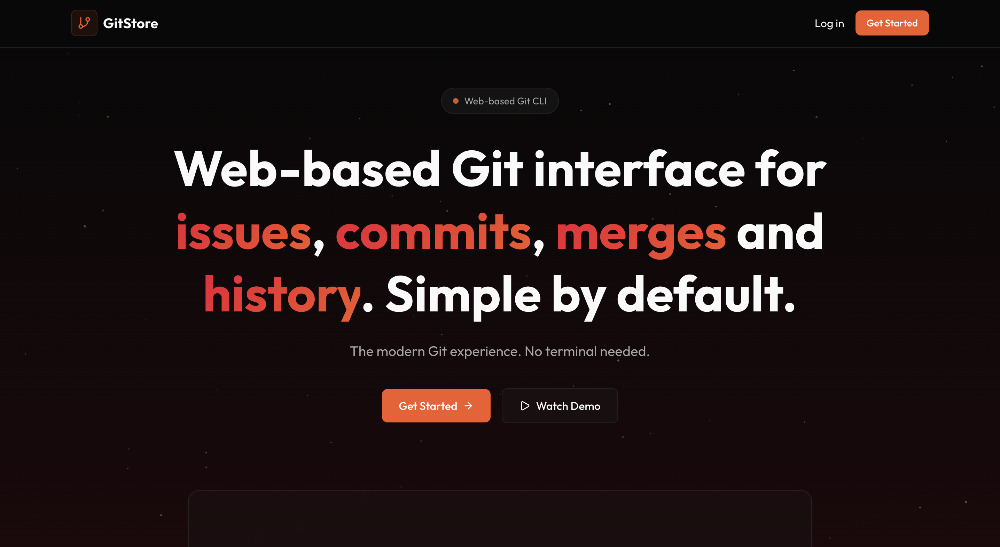
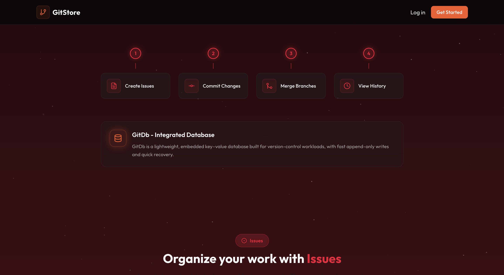
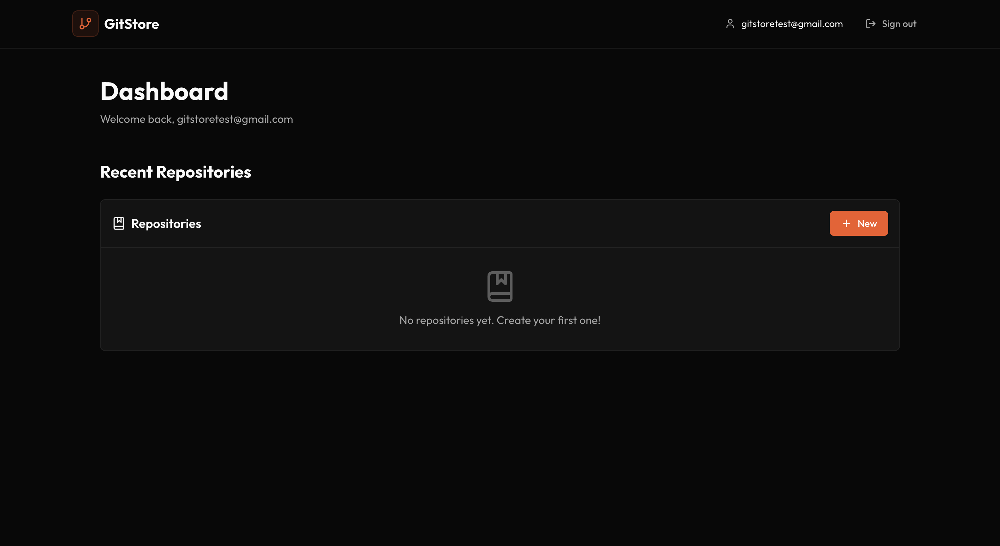
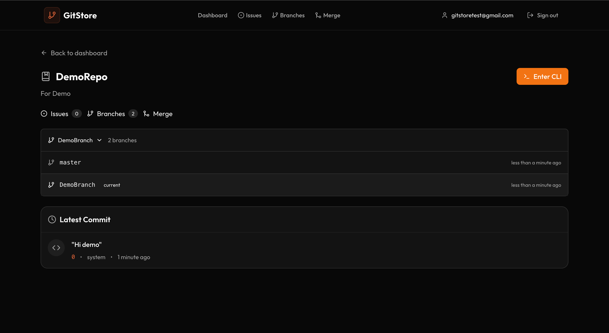
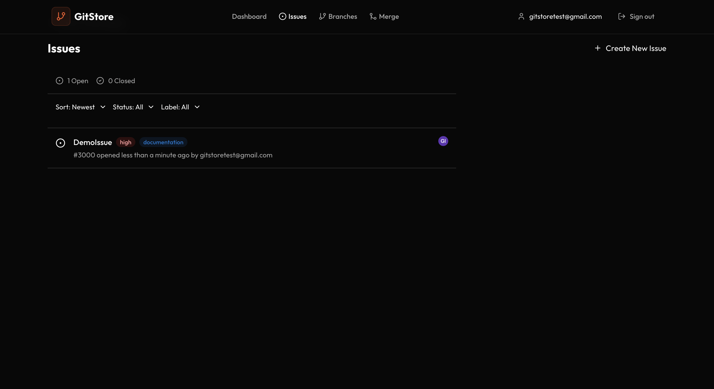
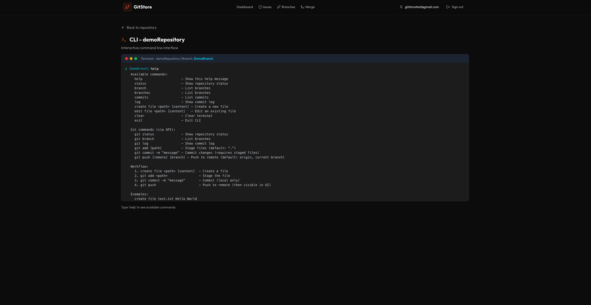
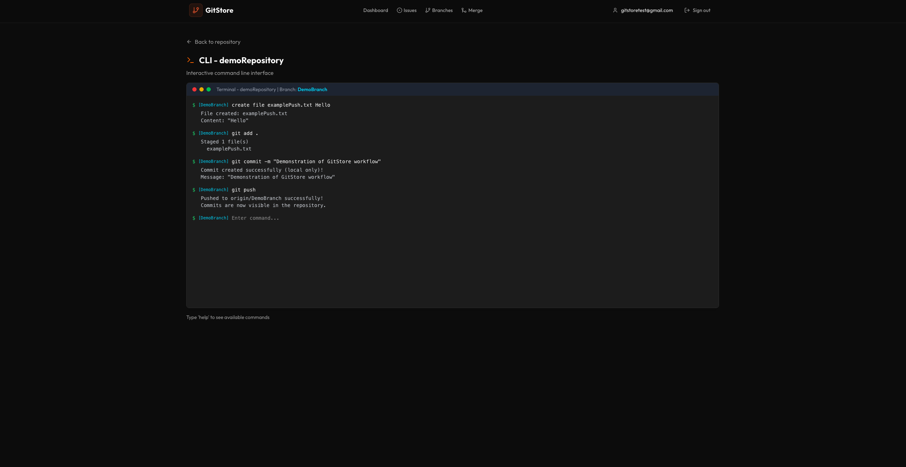

## GitStore

GitStore is a lightweight version control system inspired by Git, implementing core features such as commits, branching and merging. It includes a command-line interface and a custom-built embedded database designed specifically for managing version control metadata and history.


### High-level Overview

GitStore lets you:

- **Create repositories** from the web UI and persist them via the Go server
- **Stage files, commit, create branches, and merge** using Git-like flows
- **Push** to update “remote refs” so commits become visible in the UI
- **Track simple issues** per repository
- Use a **Node CLI** for local file operations and standard Git operations

### UI & User Experience

The web client is designed with a clear layout and predictable navigation, with an emphasis on usability

#### Landing Page

Clean landing experience with onboarding-oriented sections and a consistent design system.




### Authentication (Firebase)

The client uses **Firebase Authentication** 

- **Email & password** 
- **Google sign-in** 

### Dashboard

The dashboard serves as the main workspace, listing repositories and providing navigation to repository features such as branches, commits, merges and issues.




### Repository Features

#### Create Repository

Repositories can be created directly from the UI and are persisted on the server via a metadata registry.


#### Commits & Push

GitStore models a “local vs pushed” distinction:

- **Commits are created locally** branch refs move.
- **Commits become visible in the UI after push**, because commit listing reads from `refs/remotes/origin/<branch>` (the “pushed view”).



#### Issues

Basic issue tracking per repository (creation, listing and status updates).



### CLI Tool

The Node-based CLI (`cli/`) is built to support:

- **File operations** (create/write/append) in local repositories.
- **Standard Git operations** for regular `.git`repositories 


#### CLI Commands





### Storage Engine

The backend uses a custom append-only key–value storage engine written in Go.

- Used for repository metadata and per-repo state
- Built to explore durability, crash recovery, and storage design tradeoffs

### API

REST API (`/api/repos/*`) for repository operations: create, branches, commits, merge, files and issues.

### Docker

Run the full system using Docker Compose:

```bash
docker compose up --build
```

**Backend API:** http://localhost:8080

**Frontend UI:** http://localhost

Data is persisted using Docker volumes:

- **Repositories:** `/data/repos`
- **Metadata DB:** `/data/db`

To reset all data:

```bash
docker compose down -v
```

### Disclaimer

This repository is built for **learning and exploration**.

### Known Limitations

- **No backend authentication/authorization** (Firebase auth is frontend-only)
- **Concurrency risks** in backend flows
- **No CI/CD** currently in the repo
- **Storage engine lacks compaction** (append-only log grows over time)

